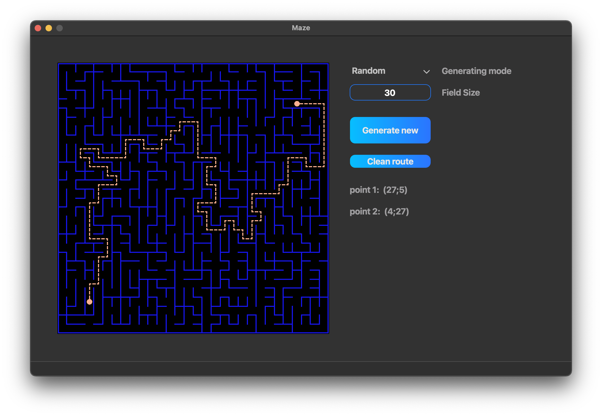
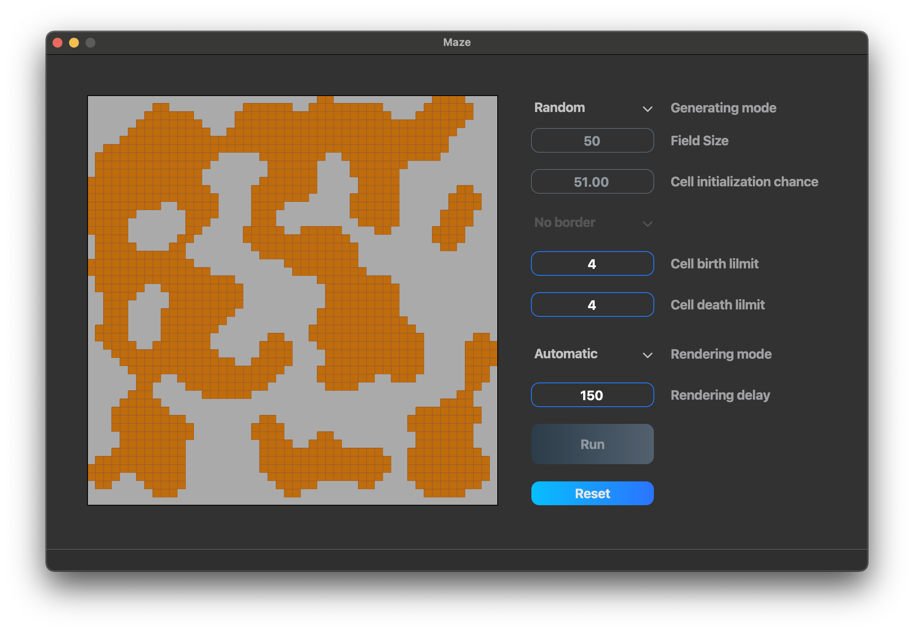

# Maze
## Gui maze and cave generator

## Short app description

- The application has two general modes: Maze and Cave, that make possible to generate maze or cave with set parameters or load their state from file (.maze and .cave files). 

- The application developed in C++ language of C++17 standard. As a GUI creation technology chosen QT6 library with C++ underneath. The application source code located in the src folder and can be built with Makefile which contains standard set of targets for GNU-programs: all, install, uninstall, clean, dvi, dist, tests, check, leaks(for macOS), valgring(for Linux).

## Interface

### The application interface includes:

- Menu bar has button "mode" to shwitch between: Maze and Cave modes (or cmd + 1, cmd + 2).

- Maze mode: This is where maze is drawn. At first launch it constantly has randomly generated confugiration. It is possible to change size in range from 10 to 50, generate new or load maze configuration from file. Also, some route can be made between two points on maze. To put these points press in any place at field of maze. Once, the second route point is put, route will be build. "Clean route" button to clean current route and set one new.

- Cave mode: This is where cave is drawn. At first launch it constantly has randomly generated confugiration. It is possible to change size in range from 10 to 50, generate new or load cave configuration from file. Stars initialization of cave can be set by "Cell initialization chance". This number means percent of enery cell initialization possibility (for example at 100% fiels will be fully filled). below there is a switcher to set or unset border drawing. Fields "Cell birth limit" and "Cell death limit" defines state of cave at next generations. "Cell birth limit" defines a minimum amount of cells around one current to make is "alive" of filled. "Cell death limit" defines maximum amount of cells around one current to make is "dead" of empty. Next generation rendering possible in two ways: manually of automatic. Switch "Rendering mode" to manually to render generation step by step by "Render next" button. Shitch "Rendering mode" to automatic to play rendering automaticly with delay that set in "Renderind delay field". Automatic rendering will stop if "Terminate" button pressed or there are no changes in cave any more. To generate new (in random mode) or reset file state (if file loaded) press "Reset" button.

## Instruction

To install the application the "make install" command execution is required in "src" folder. The application to launch will be located in "build" folder of the project root.

Uninstallation is done through execution "make uninstall" command. Thus, the executable file will be deleted from "build" folder.

Execution "make dist" command will build application if it is not, and put it into "tar" archive. The archive will be located in "build" folder of the project root.